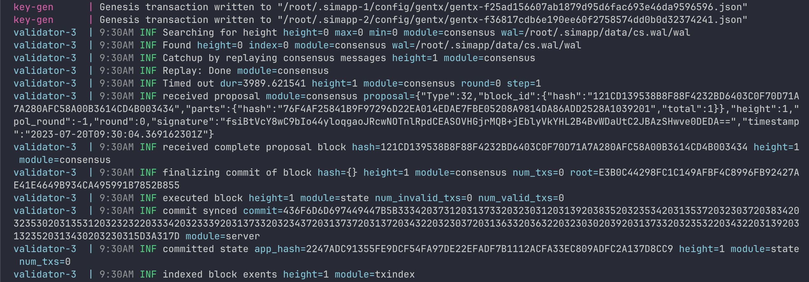
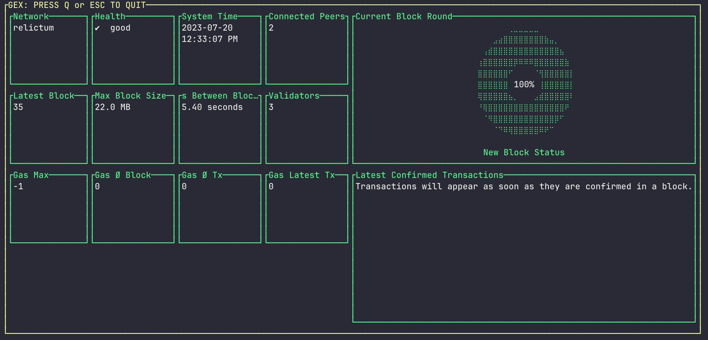

# 🌟 Relictum Simapp 🌟

Relictum Simapp is based on Cosmos SDK. Locally running Relictum network allows you to send transactions, be validator and earn interest, use your assets for settlement securely, create community proposals and much much more.

## 📋 Prerequisites
Before you begin, ensure you have the following installed:
- 🐳 docker
- 👾 docker-compose

## 🚀 Running the Cluster
To launch the local cluster, use the following command:
```bash
docker-compose up --build -d
```
This action may take some time as it needs to download external dependencies like Cosmos SDK. This is a one-time operation.



Configurations and keys for each of the three nodes are generated in the `gen-keys` docker container. For more details, refer to this [file](scripts/gen-keys.sh) with all related commands.

After the keys, configurations, and genesis file are generated, you can find them in the `docker/data` folder. When you restart the cluster with docker-compose, these files will remain the same and won't be regenerated. The blockchain state is preserved between each node as well.

Remember, you **cannot change the genesis file after the network has started**. If you wish to edit the genesis file before the network starts, use the following commands to generate and start network separately:

```bash
rm -rf docker/data
cd docker
docker-compose run --rm -it gen-keys

# edit docker/data/.simapp-1/config/genesis.json

docker-compose up --build -d
```

## 🔍 Explorer
Several open source options are available to visually observe what happens in the Cosmos SDK based networks. One of the most convenient options is the [GEX 🔗 ↗](https://github.com/cosmos/gex) explorer. Follow the instructions on the GEX page to install it.

To run the GEX explorer, simply use the following command in your terminal:
```bash
gex
```


## 💰 GTN native token

Note that the decimal places for the native GTN token have been changed from 6 to 8 due to technical requirements. For more details, you can explore the `RegisterDenom` function in [this file](relictumd/main.go). 💸